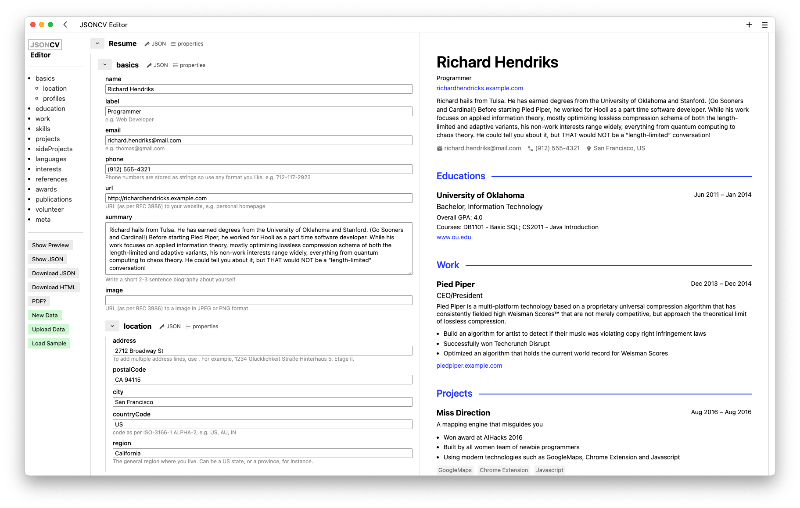
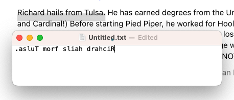

# jsoncv

A toolkit to construct your Curriculum Vitae/Résumé using JSON and produce stylish HTML/PDF documents.

jsoncv comprises the following components:
1. Schema
2. Editor
3. CV HTML
4. Converters

For in-depth explanations and usage guidelines, please refer to the documentation below.


## Introduction

### Schema

jsoncv use [JSON Schema](https://json-schema.org/) to create JSON-based standard for CVs.

The schema used in jsoncv is a fork of the [JSON Resume Schema](https://jsonresume.org/schema/),
with the following differences:

- JSON Schema version

    JSON Resume utilizes the outdated draft-04 version, while jsoncv uses the current draft-07. To ensure compatibility with draft-07, all instances of `additionalItems` have been removed.
- Additional "sideProjects" section

    jsoncv includes an additional section, called "sideProjects", that allows for the distinction between side projects and career projects
- Additional "name" property in "meta" section

    jsoncv includes a "name" property in the "meta" section, which allows the user to specify the desired name for exported HTML/PDF files.

These differences do not impact the compatibility between jsoncv and JSON Resume. This means that you can easily import JSON Resume data into jsoncv and vice versa, as jsoncv data will pass the validation of JSON Resume Schema .

The complete diff between the JSON Resume schema and the jsoncv schema can be viewed [here](https://github.com/reorx/jsoncv/compare/eabd65fd5a9a126e2de9e2955485c0dca4483c79...master#diff-3b8e847cb1664e291a7635b037a2f2bf831e1e9ce2d915fbfbba9ca77e2a1d1b)

### Editor



jsoncv comes with an online editor that provides a graphical user interface for creating and editing your jsoncv data.
Visit it at https://jsoncv.reorx.com/editor/.

The Editor consists of three columns, from left to right:

1. Sidebar

    Allows navigation to different sections in the schema form and provides operations such as "Download HTML" and "Upload Data"
2. Schema Form

    Lets you edit the properties of your CV data. You can also select which properties to display or hide.
3. Preview

    Displays the rendered CV HTML as changes are made in the Schema Form.

### CV HTML

The core product of jsoncv is CV HTML, which is the HTML representation of your jsoncv data.
It is a compact, single-file HTML document that can be converted to PDF or hosted online to create a static CV website.

CV HTML is designed with a specific layout to display a CV on an A4 sheet of paper.
The CSS has been tailored to optimize printing, ensuring the best output whether printed on paper or saved as a PDF.
Therefore, CV HTML is best suited for creating professional or academic CVs/resumes,
rather than creative or interactive portfolio websites.

CV HTMl supports themes, which can be found in the `src/themes` directory.

### Converters

Converters are scripts to help user converting jsoncv data from/to other sources.

Currently, there is only one converter available: `rxresume-to-jsoncv.js`, which converts data exported from [RxResume](https://rxresu.me/) into the jsoncv format.

If you have any additional requirements, please feel free to submit an issue. Pull requests are also greatly appreciated.

## Usage

### Write your CV

It is recommended to write your CV throught the online [Editor]().
However, if you are familiar with JSON, you can also maintain the data file in a text editor locally.

When you first open the Editor, a sample data is loaded, you can just edit it or click "New Data" button
to start with an empty form. The CV data will be saved in browser any time you made a change,
so you don't need to worry about losing your work.

If you have a local copy of the CV data, you can click "Upload Data" button to load it into the Editor.

### Export CV data and HTML

After you completed editing, you can click "Download JSON" button to export the CV data in JSON format.

To export the rendered HTML in Preview pane, click the "Download HTML" button.

Note that you can name the exported files by adding the `meta.name` property,
if it's not specified, a combination of "basics.name" and "meta.version" will be used to construct the filename instead.

### Convert HTML to PDF

To maintain simplicity, jsoncv neither implement nor include any external tools to provide PDFs.
Instead, you should use the generated HTML file to convert it to a PDF document.
The only dependency is a modern browser, the steps below takes Chrome as an example:

1. Open the generated HTML file in Chrome.
2. Press <kbd>⌘ P</kbd> (or <kbd>⌃ P</kbd> in Windows), the Print dialog should be opened.
3. In the dialog, select "Destination" as "Save as PDF", and make sure all the Options are unchecked.

    
4. Click "Save" to save the PDF file in your file system.

Note that the PDF exported from Chrome may have some issues with text copying, see more details in the [FAQ](#text-copied-from-the-pdf-is-reversed) section.

### Build a static CV site

jsoncv use [Vite](https://vitejs.dev/) as the static-site building tool,
you can easily create you own CV site by the following steps.

*TBC*

### Create your own theme

jsoncv includes some built in themes that you can use directly in the Editor or when building the static CV site.

The file system hierarchy is as below:
```
src/themes
└── reorx
    ├── index.ejs
    └── index.scss
```

You can add your own theme by creating a new folder under `src/themes`
with the `index.ejs` and `index.scss` files.

`index.ejs` is the [ejs](https://ejs.co/) template used for structuring the CV content.
The structure of the data it receives is as below:
- `cv`: the whole jsoncv data conforms to the jsoncv schema
- `fn`: a set of utility functions
  - `getCVTitle`: get the CV title from `cv` data
  - `reformatDate`: transform a date string to a specified format
  - `getIconSVG`: get the iconify svg string or DOM element from the icon name
  - `noSchemaURL`: remove the schema (`https://`) prefix of the url

Check the complete definition in [src/themes/data.js]().

After a new theme is created (take `yourtheme` as the example), run the following code to start developing with preview:

```
THEME=yourtheme npm run dev-site
```

Pull requests for adding new themes are always welcomed.

> You can just name the theme by your own name, this is what I did for the theme I use (`reorx`).
> Because I think that theme is tightly bound to the developers asetic and personal taste,
> common words is not accurate to represent.


## Tech stack

- vite
- ejs
- scss
- iconify
- ajv


## FAQ

### Text copied from the PDF is reversed

Chrome "Save as PDF" produces documents with backwards text when copying
in Preview.app on MacOS.



This is a problem of Chrome, As seen in:
["Save as PDF" produces documents with backwards text. - Google Chrome Community](https://support.google.com/chrome/thread/29061484/save-as-pdf-produces-documents-with-backwards-text?hl=en&dark=0)

Solutions:

1. Use Firefox
2. Use CLI tools like [WeasyPrint](https://github.com/Kozea/WeasyPrint)


## TODO

- [ ] Allows switching themes in Editor
- [ ] Allows customizing primary color for the current theme
- [ ] Export PDF directly
- [ ] Supports responsive style for themes, so that the CV site is friendly to view on mobile devices.
- [ ] Add more themes.


## Credits

jsoncv could not be made possible without these awesome projects below:

- [JSON Resume](https://jsonresume.org/)
- [json-editor](https://github.com/json-editor/json-editor)
- [iconify](https://iconify.design/)
